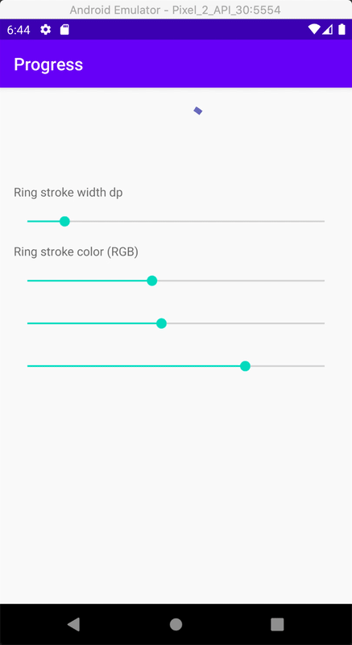

# Circular Progress View

### What is that?
This is a simplified version of the original Android `CircularProgressDrawable` contained of the Google `SwypeRefreshLayout` library.

### What is the difference
This implementation has the following differences:

- 100% Kotlin
- It does not have an arrow as part of the drawable
- It does not support manual animation revealing the arrow through a gesture, like the original one.
- The size is a big as the bounds of the container `View`
- It draws the stroke line of the animation with a gradient. The original version uses solid color.
- Additional `CircularProgressView`. It wraps the drawable and takes care of starting and stopping the animation when the view is attached and visible. It also provides convenience methods and custom xml attributes for setting the tint color and the stroke width of the animation.

### How does it look

### How to use it?

Well, I don't intend putting it on any maven repository. Just feel free to copy paste the code and adapt it to your needs.
